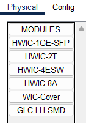

## [HWIC - 2T](README.md)

1. Apagamos el Router.
2. Buscamos en módulos el HWIC-2T

   
   
3. Pinchamos y arrastramos el módulo que está ubicado abajo a la derecha.

   
   
4. Colocamos el módulo en un hueco del router.

   
---

Siguiente -> [Configuración Router PAP](routerpap.md) o [Configuración Router CHAP](routerchap.md)
