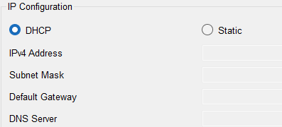

## [Configurar IP's en PC's](README.md)

1. Seleccionamos el PC a configurar. Pinchamos en 'Desktop' -> IP Configuration

2. Pinchamos en donde pone DHCP para que el router le asigne una IP dinámica.

---
> [!WARNING]
> No olvidemos que un PC tiene que ir como admin configurado con la IP de la VLAN Admin

---
Siguiente -> [Comprobaciones](comprobaciones.md)
