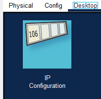
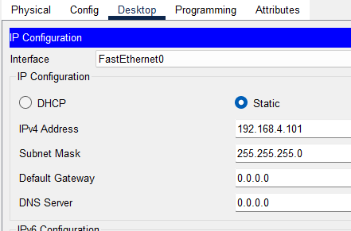

## Configurar IP's en PC's

1. Seleccionamos el PC a configurar. Pinchamos en 'Desktop' -> IP Configuration

2. Modificamos la IPv4 Address por la que nos den
3. Cambiamos la Default Gateway por la que hayamos configurado en cada VLAN

> [!WARNING]
> No olvidemos que un PC tiene que ir como admin configurado con la IP de la VLAN Admin

Siguiente -> [Configurar Router](router.md)
