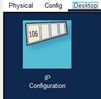

## [Configurar IP's en PC's](README.md)

1. Seleccionamos el PC a configurar. Pinchamos en 'Desktop' -> IP Configuration

2. Modificamos la IPv4 Address por la que nos den
3. Cambiamos la Default Gateway por la que hayamos configurado en cada red.

---
> [!NOTE]
> Para comprobar que funciona, debemos hacer ping desde un PC hasta otro PC

---
